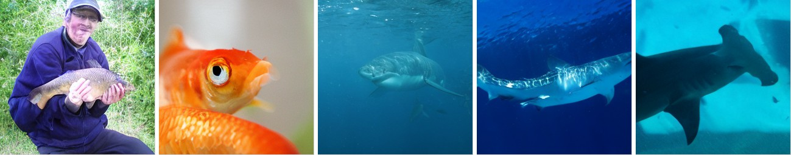

# DuoDiT: A Parameter-Efficient Dual-Stream Architecture for Image Generation in Diffusion Transformers

Official PyTorch implementation of **DuoDiT**, published in *Multimedia Tools and Applications* (Springer, 2026).

[](https://link.springer.com/article/10.1007/s11042-026-21926-y)
[](https://doi.org/10.1007/s11042-026-21926-y)

> **DuoDiT: a parameter-efficient dual-stream architecture for image generation in diffusion transformers**<br>
> Mostafa Shahbazi Dil, Mohammad Mahmoudabadi, Mansoor Rezghi<br>
> *Multimedia Tools and Applications* 85(10), article 780, 2026



## Overview

DuoDiT extends a pre-trained [DiT-XL/2](https://github.com/facebookresearch/DiT) (256×256, ImageNet) with a lightweight
second stream and fine-tunes **only that stream and the output layer** (about 18M of 690M parameters, ≈2.6%). The
pre-trained DiT backbone stays frozen.

* **Main stream**: the standard DiT path (patch size 2, 28 adaLN-Zero blocks).
* **Second stream (`x2`)**: the noisy latent is embedded with finer patches (`patch_size // 2`). A learnable CLS token is
  appended to every group of four patches, the sequence goes through a single ViT block initialised from a pre-trained
  timm ViT (`vit_large_patch16_224`, last block), and only the CLS outputs are kept.
* **Fusion**: the CLS outputs are added to the main-stream tokens after the DiT blocks, just before the final layer.
  Optional variants (`x2_fuse_every`, `x2_condition_with_c`) are in [`models.py`](models.py).

Trainable parts: `x2_embedder`, `x2_cls_tokens`, `x2_vit_block` (+ projections if widths differ) and `final_layer`.

## Repository layout

| Path | Purpose |
|------|---------|
| [`models.py`](models.py) | DiT / DuoDiT model definition |
| [`train_x2_finetune.py`](train_x2_finetune.py) | DuoDiT fine-tuning with a frozen backbone (DDP, resumable) |
| [`train.py`](train.py) | Original DiT training script |
| [`sample.py`](sample.py) | Sample a few images |
| [`sample_ddp.py`](sample_ddp.py) | Sample 50K images for FID (writes an ADM-compatible `.npz`) |
| [`sample_balanced_ddp.py`](sample_balanced_ddp.py) | Class-balanced sampling |
| [`compute_classwise_fid.py`](compute_classwise_fid.py) | Class-wise FID with `clean-fid` |
| [`checkpoint_io.py`](checkpoint_io.py), [`download.py`](download.py), [`diffusion/`](diffusion) | Checkpoint I/O, weight download, diffusion utilities |
| [`notebooks/`](notebooks) | Evaluation notebooks (FID, KID, LPIPS, CMMD, FD-DINOv2, Vendi) and Colab fine-tuning |
| [`final_experiments_results/`](final_experiments_results) | Raw logs behind the paper's tables (FID, KID, LPIPS, FLOPs, ablations) |
| [`docs/`](docs) | Fine-tuning guide and PEFT method notes |
| [`tests/`](tests) | Unit tests |

## Setup

```bash
git clone https://github.com/mrdjango/DuoDiT.git
cd DuoDiT
conda env create -f environment.yml
conda activate DiT
```

The pre-trained DiT-XL/2 weights and the timm ViT weights are downloaded automatically on first use.

## Fine-tuning

```bash
torchrun --nnodes=1 --nproc_per_node=N train_x2_finetune.py \
    --model DiT-XL/2 \
    --data-path /path/to/imagenet/train \
    --classes $(seq -s ' ' 0 999) \
    --global-batch-size 256 \
    --pretrained-ckpt DiT-XL-2-256x256.pt
```

`--classes` selects the ImageNet class indices to train on. Training checkpoints can be resumed with `--resume`. See
[`docs/finetuning.md`](docs/finetuning.md) for details.

## Sampling

```bash
python sample.py --model DiT-XL/2 --image-size 256 --ckpt /path/to/duodit.pt --cfg-scale 4.0
```

## Evaluation

Generate 50K samples and an `.npz` for [ADM's evaluation suite](https://github.com/openai/guided-diffusion/tree/main/evaluations):

```bash
torchrun --nnodes=1 --nproc_per_node=N sample_ddp.py \
    --model DiT-XL/2 --ckpt /path/to/duodit.pt --num-fid-samples 50000
```

Class-balanced sampling and class-wise FID:

```bash
torchrun --nproc_per_node=N sample_balanced_ddp.py --ckpt /path/to/duodit.pt --num-samples 50000
python compute_classwise_fid.py --real-dir /path/to/real --samples-dir /path/to/generated --output classwise_fid.json
```

Filenames of balanced samples look like `000000-class0972.png`. For other naming schemes use `--class-map` or
`--class-regex` (see `python compute_classwise_fid.py --help`). Other metrics (KID, LPIPS, CMMD, FD-DINOv2, Vendi) are
in [`notebooks/`](notebooks).

### Reported results

Logged results for the 200-epoch DuoDiT model (ImageNet 256×256, 50K samples, ADM suite; raw outputs in
[`final_experiments_results/`](final_experiments_results)):

| Model | FID ↓ | sFID ↓ | IS ↑ | Precision ↑ | Recall ↑ | KID ↓ | FLOPs | Params (trainable) |
|-------|-------|--------|------|-------------|----------|-------|-------|--------------------|
| DuoDiT (200 ep) | 2.22 | 5.19 | 276.7 | 0.81 | 0.59 | 0.0014 | 267.1 G | 690.4M (17.95M) |

Please refer to the paper for the full comparison with DiT, LightningDiT and Fine-Diffusion, and for the ablations.

## Tests

```bash
python -m pytest tests
```

## Citation

If you use this code or find our work useful, please cite:

```bibtex
@article{ShahbaziDil2026DuoDiT,
  title   = {DuoDiT: a parameter-efficient dual-stream architecture for image generation in diffusion transformers},
  author  = {Shahbazi Dil, Mostafa and Mahmoudabadi, Mohammad and Rezghi, Mansoor},
  journal = {Multimedia Tools and Applications},
  volume  = {85},
  number  = {10},
  pages   = {780},
  year    = {2026},
  doi     = {10.1007/s11042-026-21926-y},
  url     = {https://doi.org/10.1007/s11042-026-21926-y}
}
```

DuoDiT builds on DiT:

```bibtex
@inproceedings{Peebles2023DiT,
  title     = {Scalable Diffusion Models with Transformers},
  author    = {Peebles, William and Xie, Saining},
  booktitle = {Proceedings of the IEEE/CVF International Conference on Computer Vision (ICCV)},
  year      = {2023}
}
```

## Acknowledgments

This codebase is built on [facebookresearch/DiT](https://github.com/facebookresearch/DiT) and borrows from OpenAI's
[ADM](https://github.com/openai/guided-diffusion) and [timm](https://github.com/huggingface/pytorch-image-models).

## License

The code is released under CC-BY-NC, inherited from DiT. See [`LICENSE.txt`](LICENSE.txt).
